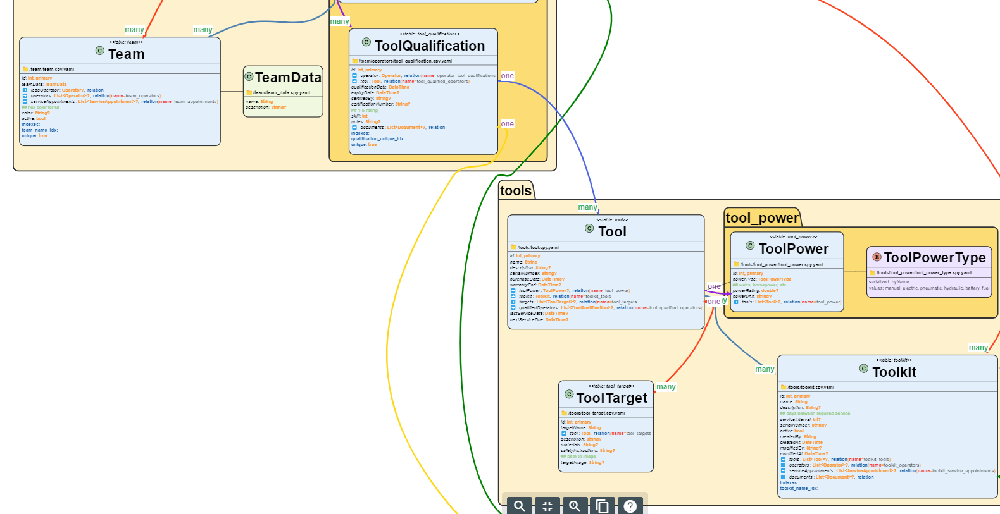

# UML for Serverpod 🗺️ 🚀

Generate PlantUML diagrams from your serverpod `.spy.yaml` model files.



## Installation

```bash
dart pub global activate uml_for_serverpod
```

Or add to your project's pubspec.yaml:

```yaml
dependencies:
  uml_generator: ^0.0.5
```

## Usage

### As a command-line tool

```bash
dart run uml_for_serverpod 
```
You can use options in the command, like:

```bash
dart run uml_for_serverpod --dir=lib/src/models --output=my_serverpod_uml_diagram.puml
```
#### CLI options

- `--dir, -d`: Directory containing .spy.yaml files (default: "lib")
- `--output, -o`: Output PlantUML file (default: "er_diagram.puml")
- `--config`: path to .yaml configuration file
- `--help, -h`: Show usage information

### As a library

**Not tested!**
```dart
import 'dart:io';
import 'package:uml_for_serverpod/uml_for_serverpod.dart';

Future<void> main() async {
  final generator = UmlGenerator(
    modelsDir: Directory('lib/src/models'),
    yamlOutputFile: File('all_yaml_content.txt'),
    umlOutputFile: File('er_diagram.puml'),
    // Optional customization
    classHexColor: '#800080',
    manyHexColor: '#008000',
  );
  
  await generator.generate();
}
```

### Configuration

You can customize the UML generation by providing a YAML configuration file:

```bash
dart run uml_for_serverpod --config=uml_config.yaml
```

Example configuration file `uml_config.yaml`:

```yaml
paths:
  modelsDirPath: lib/src/models
  umlOutputFile: 'uml_diagram.puml'
options:
  printComments: true
  useNameSpace: true
  ignoreRootFolder: 'models'
layout:
  skinparamNodesep: 30
  skinparamRanksep: 100
style:
  relations:
    colorfullArrows: true
    oneHexColor: '#9b59b6'
    oneString: 'one'
    manyHexColor: '#27ae60'
    manyString: 'many'
    relationHexColor: '#0164aa'
  class:  
    classNameHexColor: '#ff962f'
    classBackgroundHexColor: '#f1f8df'
    classBorderHexColor: '#333333'
  comment:
    commentHexColor: '#93c47d'
  namespace:
    namespaceBorderHexColor: '#333333'
    rootNamespaceBackgroundHexColor: '#fff2cc'
    firstLevelNamespaceBackgroundHexColor: '#ffe9a7'
    secondLevelNamespaceBackgroundHexColor: '#ffdb72'
```
#### Paths
- `umlOutputFile`: If set, this will be the output path. If another value is set in the command line, it will override this.
- `modelsDirPath`: If set, this will be starting point for `.spy.yaml` files. If another value is set in the command line, it will override this.
#### Options
- `printComments`: If set to false, comments won't be printed
- `useNameSpace`: If set to true, the objects in the UML diagramm will be grouped in packages according to the folder structure (two levels deep). If set to false, all objects will be loose.
- `ignoreRootFolder`: If `useNameSpace` is set to true and `ignoreRootFolder` is set to the string of a folder inside `modelsDirPath`, this folder will be ignored when grouping the objects in packages.
#### Layout
- `skinparamNodesep`: If given a value, the uml style will include `skinparam nodesep` with the given value.
- `skinparamRanksep`:  If given a value, the uml style will include `skinparam ranksep` with the given value.
#### Style
##### Relation
- `colorfullArrows`: If set to true, the arrows will be created in 6 different colors that are easy to tell apart. I set to false, the arrows will be black.
- `oneString`: String used to annotate the one side of a relation.
- `oneHexColor`, `oneString`: same as the many variant, but for the one side.
- `manyString`: String used to annotate the many side of a relation.
- `commentsHexColor`: The color of the comments' text.
- `manyHexColor`: color of the annotation text for the many side of a relation.

The rest are color settings and are self explanatory.

**Notice**: `skinparam` has been deprecated and styles should be migrated to the `<style>` api.

## Visualize your .puml file

The best way to visualize the diagram, provided that you use vscode, is this extension:

https://marketplace.visualstudio.com/items/?itemName=jebbs.plantuml

There might be plantuml extensions for other IDEs.

You can also visualize your .puml file pasting the code here:

https://editor.plantuml.com/

However, long files might not render in the online editor (at least mine doesn't), but do render using the extension 🤷‍♂️.

## Customize

In addition to the configuration options in the `.yaml` file, you can tinker with your `.puml` after it's been generated and see the updated diagram with your changes. 

There are many additional settings that you can use to style your UML diagram - you can find some of them here:

https://plantuml.com/en/skinparam

https://plantuml.com/en/style

https://plantuml.com/en-dark/class-diagram

https://plantuml.com/en/commons

https://plantuml.com/en/deployment-diagram

## Contribute

package? Contributions are very welcome!
