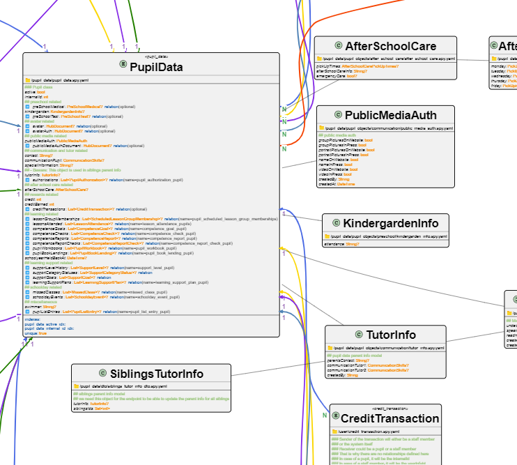

# UML for Serverpod

Generate PlantUML diagrams from your serverpod `.spy.yaml` model files.



## Installation

```bash
dart pub global activate uml_for_serverpod
```

Or add to your project's pubspec.yaml:

```yaml
dependencies:
  uml_generator: ^0.0.4+1
```

## Usage

### As a command-line tool

```bash
dart run uml_for_serverpod 
```
You can use options in the command, like:

```bash
dart run uml_for_serverpod --dir=lib/src/models --output=my_serverpod_uml_diagram.puml
```
#### CLI options

- `--dir, -d`: Directory containing .spy.yaml files (default: "lib")
- `--output, -o`: Output PlantUML file (default: "er_diagram.puml")
- `--config`: path to .yaml configuration file
- `--help, -h`: Show usage information

#### Configuration

You can customize the UML generation by providing a YAML configuration file:

```bash
dart run uml_for_serverpod --config=uml_config.yaml
```

Example configuration file `uml_config.yaml`:

```yaml
# uml_config.yaml - Example configuration file
printComments: true
colorfullArrows: true
useNameSpace: true
ignoreRootFolder: 'models'
umlOutputFile: 'uml_diagram.puml'
modelsDirPath: lib/src/models
commentHexColor: '#93c47d'
manyHexColor: '#27ae60'
manyString: 'N'
oneHexColor: '#9b59b6'
oneString: '1'
relationHexColor: '#0164aa'
namespaceBackgroundHexColor: '#fff2cc'
namespaceBorderHexColor: '#33333'
classNameHexColor: '#ff962f'
classBackgroundHexColor: '#eee'
classBorderHexColor: '#333333'
```

- `printComments`: If set to false, comments won't be printed
- `colorfullArrows`: If set to true, the arrows will be created in 6 different colors that are easy to tell apart. I set to false, the arrows will be black.
- `useNameSpace`: If set to true, the objects in the UML diagramm will be grouped in packages according to the folder structure (two levels deep). If set to false, all objects will be loose.
- `ignoreRootFolder`: If `useNameSpace` is set to true and `ignoreRootFolder` is set to the string of a folder inside `modelsDirPath`, this folder will be ignored when grouping the objects in packages.
- `umlOutputFile`: If set, this will be the output path. If another value is set in the command line, it will override this.
- `modelsDirPath`: If set, this will be starting point for `.spy.yaml` files. If another value is set in the command line, it will override this.
- `commentsHexColor`: The color of the comments' text.
- `manyHexColor`: color of the annotation text for the many side of a relation.
- `manyString`: String used to annotate the many side of a relation.
- `oneHexColor`, `oneString`: same as the many variant, but for the one side.

The rest are setting colors and are self explanatory.

### As a library

**Not tested!**
```dart
import 'dart:io';
import 'package:uml_for_serverpod/uml_for_serverpod.dart';

Future<void> main() async {
  final generator = UmlGenerator(
    modelsDir: Directory('lib/src/models'),
    yamlOutputFile: File('all_yaml_content.txt'),
    umlOutputFile: File('er_diagram.puml'),
    // Optional customization
    classHexColor: '#800080',
    manyHexColor: '#008000',
  );
  
  await generator.generate();
}
```


## Visualize your .puml file

The best way to visualize the diagram, provided that you use vscode, is this extension:

https://marketplace.visualstudio.com/items/?itemName=jebbs.plantuml

There might be plantuml extensions for other IDEs.

You can also visualize your .puml file pasting the code here:

https://editor.plantuml.com/

However, long files might not render in the online editor (but do render using the extension 🤷‍♂️).

## Customize / contribute

There are many uml customization options available, you can play around with them:

https://plantuml.com/en-dark/class-diagram

https://plantuml.com/en/commons

You found a way to improve this package? Contributions are very welcome!
